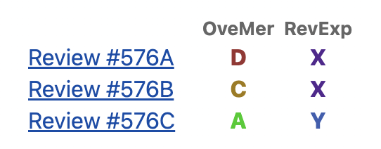
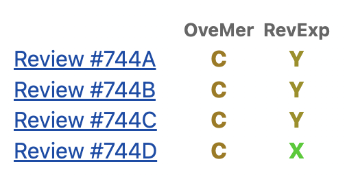
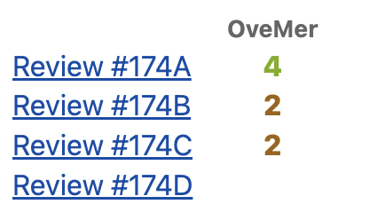
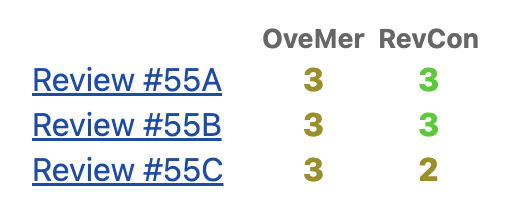
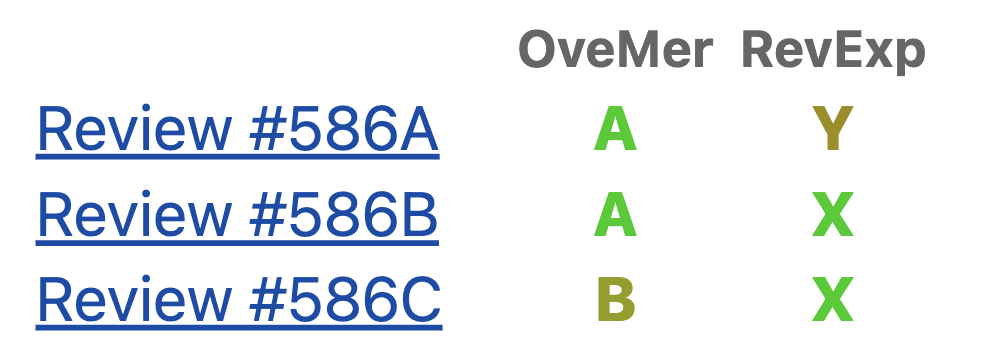

***"4번 떨어지고 5번째 붙기"***

혁신적인 연구일수록, 쉽게 받아들여지지 않는다.
POPL 2022에서 발표한 나의 연구[1] 또한 그러했다.
이 연구는 약 3년 동안 총 4번 (OOPSLA 2019, PLDI2020, ICSE 2021, OOPSLA 2021) 떨어지고 나서야 POPL 2022에 붙어 발표되었다.
누구나 그렇듯이, 고생해서 작성한 논문이 안 좋은 리뷰 코멘트를 받을 땐 의지가 꺾이기 마련이다.
예를 들어 아래는 첫 번째 제출에서 떨어질 때 받았던 리뷰 코멘트이다.

> "Overall, due to the overselling of the contribution and the lack of empirical benefit, this paper should be rejected."

약 3년간 매번 떨어지면서 더 이상 낼 곳도 없고 주제가 미워져 집어 치우고 싶을 때도 있었다.
그때마다 누군가 결국 가치를 알아줄 것이라고 믿고 버티며 약점들을 보완해 나갔었다.
결국 오랜 버팀 끝에 가치를 알아봐 주시는 리뷰어분들을 만나 논문을 출판할 수 있게 되었다.
아래는 마지막 제출 때 붙으며 받았던 리뷰 코멘트이다.

> "POPL should accept this paper to encourage discussions."

논문이 말하고자 하는 바는 간단하다.
위치 기반 함수호출 요약 방법 (call-site sensitivity)이 값 기반 함수 호출 요약 방법(object sensitivity)보다 더 좋다는 것이다.
논문이 혁신적인 이유는  값 기반 함수 호출 요약은 가장 좋은 함수 호출 요약 방법으로 알려져 있는 반면 위치 기반 함수 호출 요약은 안 좋은 함수 요약 방법으로 알려져 있다는 것이다.
예를 들어 위치 기반 함수 호출 요약은 아래와 같이 무시를 받아왔다 (아래 글에서 2cs+h는 2-call-site sensitivity를 의미한다).

>"For comparison purposes, we have included 2cs+h to demonstrate the superiority of object-sensitivity over call-site-sensitivity." [2]

현재 전 세계 정적 분석 수업에서는 값 기반 요약이 위치 기반 요약보다 좋다고 가르치고 있고, 연구들 또한 값 기반 함수 호출 요약을 개선하는 방향에 집중하고 있다.
이 논문은 이러한 분위기 속에서 (**눈치 없이**)  위치 기반 요약이 오히려 더 좋을 수 있다는 것을 보였다.

## 첫 번째 제출

처음 논문을 (OOPSLA 2019에) 제출했을 때 받았던 점수는 D(reject), C(weak reject), A(accept)였다.

Reject와 weak reject을 준 리뷰어분들은 expert, Accept을 준 리뷰어 분은  knowledgeable이셨다.
하나의Accept를 받긴 했지만 전문가(expert)분들의 마음을 돌리지 못해 결국 떨어졌었다.

## 두 번째 제출

두번째 제출은 PLDI 2020이었다.
받은 점수는 C(weak reject), C(weak reject), C(weak reject), C(weak reject)였다.

중요한 실험이 하나 누락된 것이 모든 리뷰어분들에게 낮은 점수를 받은 이유였다.
대학원에 입학 후 받은 리뷰 점수들 중 가장 낮은 점수였다.
제대로 반박(rebuttal) 조차 작성하지 못하였기에 한동안 우울했던 것이 기억이 난다.

## 세 번째 제출

세 번째 제출은 ICSE 2021이었다.
받은 점수는 A(accept), C(weak reject), C(weak reject)이었다.

충분히 해볼만 하다고 여겨 반박(rebuttal)을 열심히 작성하였으나 최종적으로는 아쉽게 떨어졌다.
이때부터는 논문이 떨어지는 것이 당연한 것처럼 느껴졌었다.
점점 자심감도 없어지고, 빨리 치워버리고 싶다고 생각도 했었다.

## 네 번째 제출

네번째 제출은 OOPSLA 2021이었다.
받은 점수는 B(weak accept), B(weak accept), B(weak accept)이었다.

떨어트리겠다는 사람이 없었기에 "드디어 됐다!" 싶었다.
당연히 붙을 줄 알고 주변 사람들에게 식사 대접도 했었다.
하지만, 최종 결과는 "Reject"였다.
리뷰 점수가 처음부터 애매했다면 무덤덤 했을텐데, 당연히 될거라 생각하다 떨어지니 너무 화나고 어이없고 당황스럽더라.

생각해보니 당시 얻어먹은 사람들이 떨어지면 환불해준다고 했었는데 아무도 환불 안해줬다.

## 다섯 번째 제출

다섯 번째 제출은 POPL 2022였다.
OOPSLA 2021에서 "Reject"메일을 받는 날이 7월 7일이었고, 7월 9일에 POPL2022에 제출했으니 떨어진 상태 거의 그대로 낸 것이다.
지도 교수님은 POPL에는 내지 말자고 하셨었다.
"POPL은 안 될텐데..." 하셨던 것이 기억난다.
더 이상 잃을게 없다는 생각에 "떨어져도 그냥 내보겠습니다"라고 말씀드린 후 제출하게 되었다.

POPL 2022에서 받은 점수는 A(strong accept), A(strong accept), B(weak accept) 였다.

대학원 입학 후 지금까지 받은 점수 중에서 최고로 높은 점수이기도 하다.
가슴 뿌듯해지는 코멘트들도 많이 받았었는데 몇가지만 공유하고자 한다.

>"I really like this paper and I think it is thought-provoking."

>"I believe POPL should accept this paper to encourage discussions."

>"The result in this paper is already prompting more ideas in me for how to extend this work, which is a very good thing in a research paper."

>"Congratulations on an excellent paper."

위 코멘트들은 평소에 연구가 잘 안 풀리거나 자신감이 떨어질 때 자주 꺼내 본다.    
잠시나마, 이때로 돌아가면 자신감이 충전된다.

 

# 배운 점

**눈높이를 낮추지 않고 끝까지 도전해야 한다.**
당장 리뷰가 안좋게 나왔다고 포기하거나 눈을 낮출 필요는 없다.
혁신적인 연구일 수록 오히려 잘 떨어진다.
조급해하지 말고 약점들을 보완해가며 때를 기다려야 한다.
언젠간 누군가 알아봐줄 것이다.
중간과정은 힘들었지만 결과적으로 POPL은 최고의 마무리였다.
연구실 입장에서도 큰 경사였고, 교수님도 인정해주시더라.
실제로 이 연구 이후에 박사 디펜스에 대해 이야기 하기 시작하였다.

 

# 참조

[1] Minseok Jeon and Hakjoo Oh. 2022. Return of CFA: call-site sensitivity can be superior to object sensitivity even for object-oriented programs. Proc. ACM Program. Lang. 6, POPL, Article 58 (January 2022), 29 pages. https://doi.org/10.1145/3498720

[2] Tan, T., Li, Y., Xue, J. (2016). Making k-Object-Sensitive Pointer Analysis More Precise with Still k-Limiting. In: Rival, X. (eds) Static Analysis. SAS 2016. Lecture Notes in Computer Science(), vol 9837. Springer, Berlin, Heidelberg. https://doi.org/10.1007/978-3-662-53413-7_24
