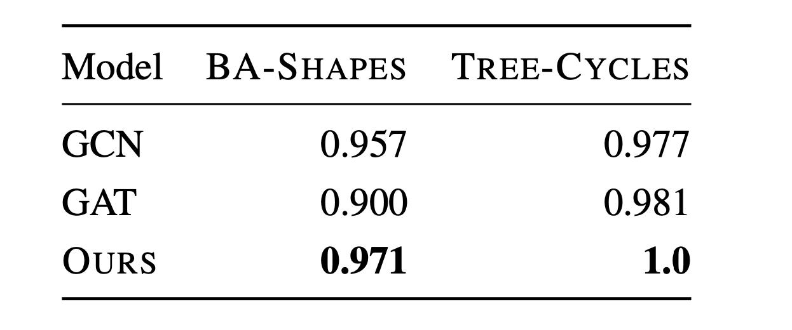
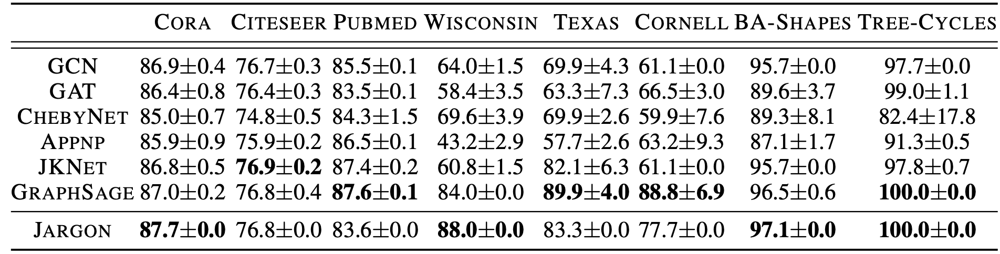
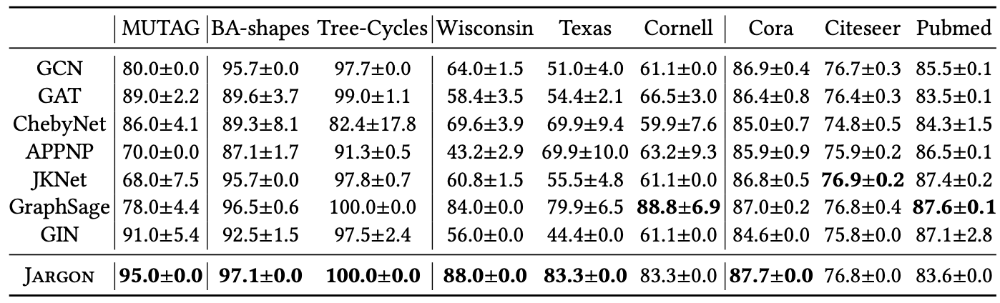
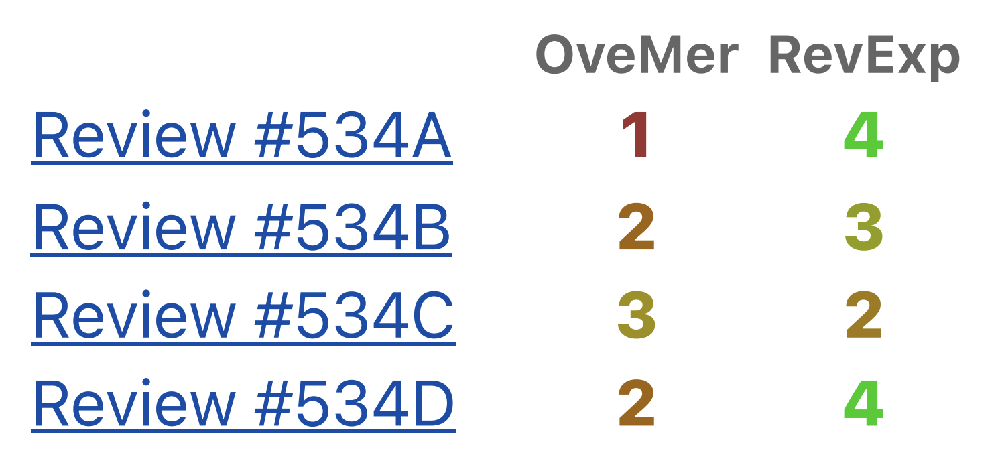
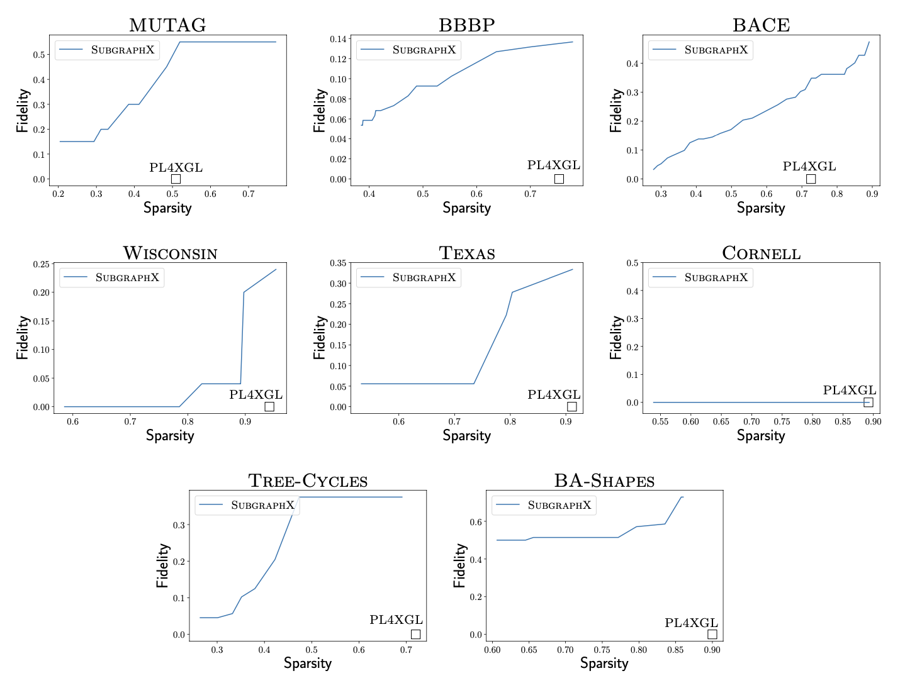
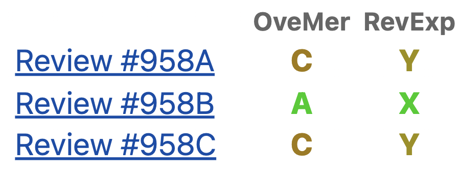

***"될 때까지 개선하기"***

될 때까지 개선하면 결국 된다.
이 글에서 소개할 연구 경험 또한 [이전 연구](https://minseokjgit.github.io/ep2/)와 마찬가지로 3년간 네 번의 떨어짐 및 개선이 있고 나서야 다섯번째에 PLDI 2024에 Accept 된 연구이다. 

이 연구에서는 그래프 데이터를 대상으로 하는 새로운 기계학습 방법을 제안하였다. 
이 연구가 혁신적인 점은 기존의 그래프 기계학습의 트렌드인 인공신경망 기반 방법(Graph Neural Network)이 아닌 프로그래밍 언어 기술을 기반으로 하는 새로운 그래프 기계학습 방법을 제안하였다는 것이다. 
개발한 방법에서 모델은 이 연구에서 디자인한 프로그래밍 언어로 작성된 프로그램이며 명확한 소스코드를 가지고 있기에 내놓은 결과들에 대해서 명확한 설명을 제공한다는 장점이 있다.
명확한 설명을 제공해 준다는 것이 (명확한 설명을 제공해 주지 않는) 기존의 인공신경망 기반 기술과 비교했을 때 이 연구에서 개발한 방법의 가장 큰 장점이다.
바닥부터 새로운 방법을 만들어서 제안하다 보니, 제출과 떨어짐의 반복을 거치며 많은 것들을 개선했어야 했다.
그 과정들을 간략하게 전달하고자 한다.

## 1. 첫 번째 제출 & 떨어짐 & 개선

첫 번째 제출은 ICML2022이었다. 아래 테이블은 첫 번째 제출한 논문에서 사용한 실험 결과 중 일부이다. 노드 분류 데이터셋 대상으로 두 가지 인공신경망 기반 기술(GCN, GAT)대비 좋은 성능을 보인다는 다소 조촐한 실험 결과이다. 

제안한 방법의 아이디어(프로그래밍 언어 기반 새로운 그래프 기계학습 방법)는 참신하다고 믿었기에 나름 기대를 했었다. 하지만, 첫 번째 제출은 빈약한 실험으로 인해 아래와 같은 리뷰를 받으며 떨어졌다.

> "The major concern is the experimental study. Only two weak baselines, GCN and GAT, are used to compare the node classification performance." 

논문에서 아이디어를 뒷받침해 주는 충분한 실험 결과는 필수적이기에 공감이 가는 리뷰이다. 
결과(Reject)를 담담하게 받아들이고 다음 제출까지 지적받은 부분을 개선하기 위해 더 많은 베이스라인 및 노드 분류 데이터셋을 추가하여 실험을 진행하였다.

## 2. 두 번째 제출 & 떨어짐 & 개선

두 번째 제출은 NeurIPS 2023이었다. 첫 번째 제출과 비교했을 때 4가지 베이스라인들이 추가되었으며 노드 분류 데이터셋도 더 많이 사용하였다. 제출한 논문에서 사용한 메인 결과는 아래와 같다.

충분한 실험 결과를 제공했다고 믿었기에 이번에도 기대감을 안고 제출했던 기억이 있다.
하지만, 다음과 같은 리뷰를 받으며 떨어졌다.

> "The current formal language is designed specifically for node classification. How easy is it to design a different domain specific language for other graph problems such as link-prediction?"

두 번째 제출까지는 제안한 기술이 노드 분류만 할 수 있었다. 하지만, 그래프 기계학습에서는 엣지 및 그래프 분류도 중요한 문제이기에 현재 버전의 기술에 부족함을 느끼고 결과에 승복할 수 밖에 없었다.
떨어진 이후 위 문제를 해결하기 위해 제안한 방법을 노드 분류 이외에도 그래프 분류와 엣지 분류에도 적용할 수 있도록 확장하였다. 

## 3. 세 번째 제출 & 떨어짐 & 개선

세 번째 제출부터는 PL 학회에 제출하기 시작하였다. 프로그래밍 언어 분야에서 개발해 온 기법들을 사용하여 만든 기계학습 기술이기에 PL 학회에 충분히 받아들여질 수 있다고 생각했었기에 세 번째 버전의 논문을 PLDI2023에 제출하였다. 제안한 기계학습 방법이 노드 분류, 그래프 분류, 엣지 분류에 적용할 수 있도록 확장하였고 실험에서는 그래프 분류 데이터셋(MUTAG)를 추가하였다.

이번에는 내용(확장된 아이디어 및 실험 결과)에 자신이 있었기에 나름대로 확신을 가지고 제출했었다.
하지만, 제출한 커뮤니티가 PL 학회로 바뀜에 따라 다른 실험 결과들을 요구하였다. 
기존의 딥러닝 기반 기술 대비 제안한 방법의 장점이 설명력이었기에, 모델의 설명력에 대한 명확한 실험 결과들을 요구하였다. 
안타깝게도 제출한 논문에서는 설명력에 대한 정성적인 비교만을 제시할 뿐(제안한 기술은 명확한 소스코드를 가지고 있어 동작을 사용자가 쉽게 이해할 수 있다. vs 인공신경망은 동작이 복잡해 사용자가 쉽게 이해할 수 없다.), 정량적인 설명력 비교 실험 결과를 제시하지 못하여 아래와 같은 리뷰를 받았었다.

>The authors need to come up with a systematic, head-to-head comparison between JARGON and existing explanation methods (with a well-defined metric) to demonstrate JARGON's advantage.

리뷰 점수도 아래와 같이 매우 낮은 점수(Reject, Weak reject, Weak accept, Weak reject)를 받으며 떨어졌다.

이 때 충격이 컷었던 것으로 기억한다. "때려쳐야 하나?"와 "처음부터 안되는 거였나?"라는 고민도 진지하게 했었었다. 
한동안 잠도 제대로 잘 수 없을정도록 우울했었다. 
그러나 연구 워크샵(ERC, SIGPL)이나 연구실에서 교수님들과 학생들이 잘 될거라고 응원해 주어 힘을 낼 수 있었다. 
기억나는것들 중 당시 힘이 되었던 조언 몇가지만 공유하고자 한다.

> "Senior들이 리뷰했으면 점수 반대로 왔을거다."

> "내가 남의 연구는 잘 보는데, 그 연구는 잘 될거다."

> "저한테는 감동적이었어요."

> "무조건이지, 끝까지 해라 그러면 다 된다."

다시 정신을 차리고
이후부터는 제안한 방법의 설명력에 대한 정량적인 실험 결과들을 만들어내는 것에 집중하였다.

## 4. 네 번째 제출 & 떨어짐 & 개선

네 번째는 POPL 2024에 제출하였다. 알려진 평가지표를 사용하여 설명력에 대한 정량적인 실험 결과들을 많이 추가하였다.
자세한 설명은 하지 않겠지만 아래 그림에서 오른쪽 아래로 갈수록 좋은 설명임을 나타낸다. 

리뷰도 아래와 같이 (Accept, Weak reject, Weak reject) 해 볼 만한 평가를 받았다. 

Rebuttal을 제출할 때만 해도 무조건 될 거라 생각했다. 결과 발표 시간 전에 CV와 홈페이지도 업데이트할 부분들을 미리 작성해둔 상태였다.

하지만, 안타깝게도 POPL 2024에 떨어졌다. 논문을 제출할 때 구현체를 제출하지 않았던 것이 발목을 잡았다. 이후 특별한 개선은 없었다. 논문을 조금 다듬은 후 구현체를 추가해 다섯 번째 제출을 하였다.

## 5. 다섯 번째 제출

다섯 번째 제출은 다시 한번 PLDI였다. 
이전 연구들까지 합하면 PLDI에는 두 번의 제출을 했었는데 항상 낮은 점수를 받았기에 제출 당시 두려움과 불안에 가득 차 있었다.
하지만 보란 듯이 좋은 점수들(Accept X 2, Weak accept X 2)을 받으며 Accept 되었다. 

기억에 남는 코멘트는 아래와 같다.

>"In summary, this paper is well written, and PL4XGL is a nice application of synthesis algorithm for graph learning and explanation. Evaluation is also in favor. Thus, I think the paper would be a nice addition to the community. Thanks for the great work!"

3년간 고생이 승화되는 것 같은 큰 기쁨이 몰려오더라. 

# 배운 점

배우는 점은 붙었을 때보다 떨어졌을 때 오히려 더 많다고 생각한다. 

+ 힘들 때 용기를 줄 수 있는 사람들을 주변에 만들어 놓자 그리고 힘들다면 도움을 받자. 다만, 그러려면 본인이 남들이 기댈 수 있는 사람이어야 한다.

+ 구현체 평소에 잘 준비해 놓고 제출날에 꼭 잘 제출하자.

+ 될 때까지 개선하다 보면 언젠간 된다.

+ 현재 이 연구 위에서 다양한 후속연구들을 진행하고 있는데, 이들은 모두 3년간 이 연구에 대해 깊이 생각하면서 발견한 것들이다. 첫 번째 제출에서 Accept되었다면 현재 하고있는 후속 연구들은 없었을 것이다.

# 참조

[1] Minseok Jeon, Jihyeok Park, and Hakjoo Oh. 2024. PL4XGL: A Programming Language Approach to Explainable Graph Learning. Proc. ACM Program. Lang. 8, PLDI, Article 234 (June 2024), 26 pages. https://doi.org/10.1145/3656464

