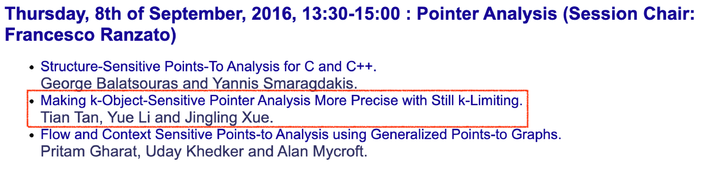
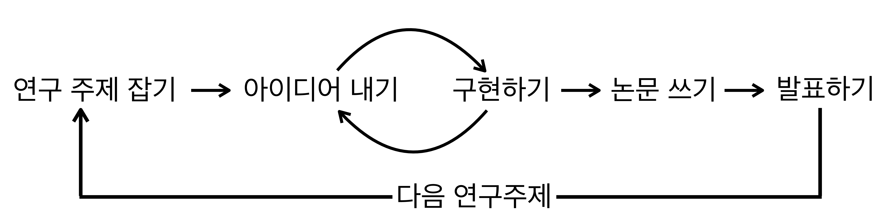

***"지도교수님이 잡아주신 연구 주제로 연구하기"***

"민석아, 우리 포인터 분석을 한번 해보자."

2016년 9월쯤, SAS (Static Analysis Symposium) 2016에 다녀오신 지도교수님께서 건내신 말이었다.
아래의 발표가 인상적이었다며, 논문을 읽어보고 관련된 연구를 해보자고 하셨다.

나의 첫 연구는 그렇게 시작 되었다.

**첫 연구는 주로 지도교수님의 추천에서 시작된다.**
연구는 기본적으로 어렵다. 아래는 대학원생이 입학 후부터 졸업할 때까지 (혹은 학계를 떠나기 전까지) 돌아야 하는 연구의 뤂이다.

위 그림에서 (1) 주제를 잡기, (2) 아이디어 내기, (3) 구현하기, (4) 논문 쓰기, (5) 발표하기 등 무엇 하나 쉬운 것이 없다.
그중에서도 가장 어렵고 중요한 부분을 뽑으라면 "연구 주제 잡기"일 것이다.
"시작이 반이다"이라는 말은 연구에서도 통한다.
좋은 주제로 연구를 시작하는 것은 첫 단추를 올바르게 잘 꿰었음을 의미하며 나머지(아이디어 내기, 구현하기, 논문 쓰기, 발표하기)는 시간이 문제일 뿐 첫 단추를 기반으로 어떻게든 올바르게 질행될 것이다.
반대로 나쁜 주제로 연구한다는 것은 첫 단추를 올바르지 않음과 같으며 나머지 단추들을 잘 끼우는 것이 매우 힘들어진다.
안타깝게도 연구 자체를 제대로 해본 적이 없는 학부연구생이나 대학원생 초년차에게 좋은 연구 주제를 만드는 것은 너무나 어려운 일이다.
나 역시 그러했다. 
연구 주제를 잡지 못해 오랫동안 끙끙대다 보면 보다 못한 지도교수님이 연구 주제를 추천해 주실 건데 주로 연구실에서 이전에 했었던 연구의 확장 또는 지도교수님의 분야에서 떠오르고 있거나 오랫동안 꾸준히 연구되어 온 주제 중 하나를 추천해 주신다.
위와 같은 주제들을 추천하는 이유는 아마도 현재 단계에서 가장 성공 확률이 높은 것 주제들이기 때문일 것이다. 
"포인터 분석"은 교수님의 분야에서 오랫동안 꾸준히 연구되어 온 주제이다.
고민할 것도 없이 "네, 해보겠습니다"라고 하였다.
그렇게 나의 첫 번째 연구[1]가 시작되었다.

**지도교수님의 추천에서 시작된 연구의 장점은 직접적인 도움을 많이 받을 수 있다는 것이다.**
내 경우 "포인터 분석"에서 *모르는 부분들을 물어보면 즉각적으로 명확하게 설명*을 해주셨다.
반대로 *내가 모르는 것 같은 부분을 정확히 지적*해주신 적도 많다.
아이디어를 내었을 때도 *지도교수님의 연구 경험에 기반한 직접적이면서 정확한 피드백*을 받을 수 있다.
"이 분야에 없었던 새로운 아이디어이다"라고 직접적으로 말씀해 주시기도 하고 "논문이 되기 위해선 이 부분은 좀 더 보완이 필요하다"라고 지적해 주시기도 하셨다.
*논문 작성 단계에서는 가장 크게 도움을 받을 수 있다.*
단 한 번도 논문을 써본 적이 없는 대학원생에게는 어쩌면 논문을 쓰는것이 가장 어려운 일일 것이다.
어떤 내용을 어떻게 써야 할지 감 자체가 없기 때문에 멍하니 화면만 바라보고 있다가 한 문장도 쓰지 못하고 하루가 지나가기도 한다.
이럴 때 지도교수님의 "이 논문[2]의 흐름을 참고해 봐 우리가 푸는 문제를 다른 방식으로 풀고 있어", "이 논문[3]의 formalization을 참고해서 우리는 어떻게 하면 좋을지 생각해 봐", "이 논문[4]의 실험을 참고해 봐"
와 같은 코멘트들은 논문 작성의 방향이나 내용을 잡는 데 큰 도움이 된다.
논문작성에서도 또한 어색하거나 이상하게 작성된 부분들은 정확하게 피드백을 받을 수 있어서 논문의 완성도를 크게 높일 수 있다.
위와 같은 도움을 받아 첫 논문[1]은 약 8개월(2016.09~2017.04)만에 멋지게 완성되어 OOPSLA2017에 발표하였다.

**지도교수님이 추천해 주신 주제로 첫 연구를 하는 것은 (내 경우) 좋은 선택이었다.**
내 몸으로 직접 한 연구 사이클(주제 잡기->아이디어 내기->구현하기->논문 쓰기->발표하기)을 경험하면서 연구의 전반적인 흐름을 익힐 수 있었다.
"연구는 이런 식으로 하는 거구나", "논문은 이런식으로 쓰는 거구나", "내 연구의 가치를 이런 식으로 보이면 되는구나" 등 연구에 대한 모든 감각이 무(0)에서 유(1)로 진화하였다.
이때 생각 감각을 키우고 이를 기반으로 지금도 연구하고 있다.

**다른 사람이 추천해 준 주제로 연구하는 것에 대한 리스크.**
주제를 추천받아 시작하는 것은 사실 양날의 검이다.
내 경우 좋은 결과로 연구를 8개월 만에 마무리 지었지만, 연구가 잘 풀리지 않아 연구 기간이 (1년 반 이상으로) 길어질 경우 문제가 생길 수 있다.
내가 직접 잡은 주제가 아니기 때문에, 흥미가 떨어지거나, 확신이 없어지는 순간에 크게 흔들리게 된다.
"다른 주제를 할걸..."이나 "이 주제를 어떻게 치워야 하나?" 고민하게 될 것이다. 
현재 주제에서 도망치더라도 도망쳐서 잡은 다른 주제에서도 같은 일이 일어나는 악순환이 시작될 수 있다.

### 결론
위와 같은 리스크에도 불구하고 첫 연구 주제로 지도교수님이 추천해 준 문제는 좋다고 생각한다.
아는 것이 없기 때문에 지도교수님으로부터 많은 것을 배울 수 있다. 
감이 없기 때문에 오히려 위기에도 더 잘 버틸 수도 있다. 
다만, 이후로는 본인이 본인만의 주제를 잡아서 연구하는 것을 추천한다. 
내가 만든 연구 주제는 나의 아이와 같다. 
다른 사람이 추천해 준 주제를 연구할 때와 비교했을 때 하는 일은 비슷할 수 있지만 마인드가 매우 크게 달라진다.
예를 들어 3년씩 버티며 연구했었던 주제들([주제1](https://minseokjgit.github.io/ep2/), [주제2](https://minseokjgit.github.io/ep3/))은 모두 내가 직접 만들어낸 주제들이었다.
모성애가 있어야 영원히 버틸 수 있다.
이에 대한 이야기는 다음 글로 풀도록 하겠다.

## 참조
[1] Sehun Jeong, Minseok Jeon, Sungdeok Cha, and Hakjoo Oh. 2017. Data-driven context-sensitivity for points-to analysis. Proc. ACM Program. Lang. 1, OOPSLA, Article 100 (October 2017), 28 pages. https://doi.org/10.1145/3133924

[2] Yannis Smaragdakis, George Kastrinis, and George Balatsouras. 2014. Introspective analysis: context-sensitivity, across the board. In Proceedings of the 35th ACM SIGPLAN Conference on Programming Language Design and Implementation (PLDI '14). Association for Computing Machinery, New York, NY, USA, 485–495. https://doi.org/10.1145/2594291.2594320

[3]Percy Liang, Omer Tripp, and Mayur Naik. 2011. Learning minimal abstractions. In Proceedings of the 38th annual ACM SIGPLAN-SIGACT symposium on Principles of programming languages (POPL '11). Association for Computing Machinery, New York, NY, USA, 31–42. https://doi.org/10.1145/1926385.1926391

[4] George Kastrinis and Yannis Smaragdakis. 2013. Hybrid context-sensitivity for points-to analysis. SIGPLAN Not. 48, 6 (June 2013), 423–434. https://doi.org/10.1145/2499370.2462191

<!--  -->