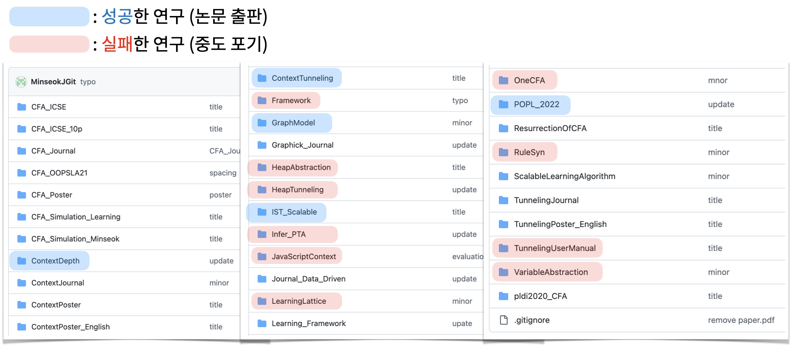

***"배울 수 있는 자료가 없다 & 가르칠 수가 없다"***

"좋은 연구 주제 찾기"는 어쩌면 대학원생이 반드시 마주해야 하는 어려움 중 가장 큰 어려움일 것이다. 
첫 단추이기 때문에 이를 해결하지 못하면 시작조차 할 수 없고 큰 무력감과 불안에 시달리게 한다.
나 역시 대학원생 2년 차에 연구 주제를 잡지 못해 매일 밤 불안에 시달렸었다. 
경험상 연구 경험이 적은 저연차 연구원에게는 특히 감당하기 어려운 불안과 무력감을 느끼게 한다. 
교수님과의 정기 연구 미팅은 논의할 것이 없는 무력한 미팅을 반복하게 되고, 척척 연구를 진행하고 있는 옆자리 사람과 비교하다 보면 불안에 시달릴 수밖에 없다.
최근 저연차 후배들도 또한 이와 같은 고민에 시달리고 있는 것을 보았고 이와 같은 대학원생들에게 조금이라도 도움이 되었으면 하여 이 글을 작성하게 되었다.

"좋은 연구 주제 찾기"가 어려운 이유는 가르칠 수 없기 때문이다. 
연구의 다른 영역들은 배울 수 있는 수업이 있거나 직접적인 지도를 받을 수 있는 경우가 많다.
예를 들어 논문 쓰기의 경우 글 쓰는 방법에 대한 수업, 책, 또는 자료는 얼마든지 찾아볼 수 있다.
문제를 풀기 위한 아이디어/구현 또한 논문에 자세하게 작성되어 있고, 구현체가 공개되어 있어 쉽게 접근이 가능하다.
하지만, 문제 찾기의 경우 배울 수 있는 수업이 없다.
논문에서도 또한 "풀고자 하는 문제가 무엇"인지가 기술되어 있지 어떻게 그 문제를 찾게 되었는지는 기술되어 있지 않다.
연구지도 과정에서도 또한 지도교수님이 문제를 주거나 학생이 찾아온 문제에 대해 논의하지, 문제를 찾는 방법에 대한 지도를 받기는 어렵다 (내 경우에는 없었다).

"연구 주제 찾기"를 가르칠 수 없는 이유는 정해진 방법이 없고 사람마다 다르기 때문이다.
다시 말해서 연구 주제 찾기는 매우 _개인적_ 이기 때문에 나의 방법이 다른 사람에게는 적용되지 않는 경우가 많다.
내 경우 문제를 찾을 때 개인적인 _불만_ 에서부터 문제를 찾아낸다 ([예시](https://minseokjgit.github.io/ep1/)).
이를 떠올리며 문제를 찾지 못해 고민하는 후배에게 "평소에 불만이 있었던 점들을 돌아봐"라고 조언을 했었는데, 후배의 대답은 "평소에 불만이 없었는데요;;"였다. 
내가 문제를 찾는 방법을 타인에게 그대로 가르칠 수 없다는 것을 이때 처음 깨달았다.

시행착오를 해가며 본인만의 연구 문제를 찾는 방법을 구축해야 한다.
안타깝게도, 이 영역에서 비법은 존재하지 않는다. 
이렇게도 잡아보고 저렇게도 잡아보고 잡은 주제로 발표 해가면서 박수도 받고 깨지기도 해보며 하나하나 경험해 가며 차근차근 구축해야 한다.
아래는 박사과정 동안 내가 잡아서 연구했었던 주제들이다.

위 폴더 중 붉은색으로 표시된 폴더는 중도 포기했던 주제들이고 파란색으로 표기된 주제는 논문까지 출판한 주제들이다. 
두 번 정도 좋은 주제를 찾는 것에 실패하면 한 번 좋은 문제를 발견했다. 즉, 제대로 된 실패가 충분히 쌓여야 좋은 기회가 찾아온다.

좋은 문제를 찾아내는 사람이 되기 위해서는 실패를 동반한 많은 "문제 찾기" 시도가 있어야 한다. 
겨우 잡아낸 연구 주제가 실패해 중도 포기할 때는 마음이 꺾이곤 한다. 
연구 미팅 또는 발표에서 부정적인 코멘트를 들을 때에도 연구가 실패할까 두려워진다.
그럼에도 불구하고 이들을 헤쳐 나가며 많은 문제들을 만들어보아야 한다.
그래야 좋은 문제를 [스스로 찾아낼 수 있는 연구자](https://minseokjgit.github.io/ep5/)가 될 수 있다.
안타깝게도 이 글이 연구 주제를 찾는 구체적인 방법을 제시하지는 못한다.
다만, 조금이라도 힘이 되었으면 한다. 
원래 어려운 것이니 너무 걱정에 시달리지 말고 많은 시도를 해보았으면 한다.

