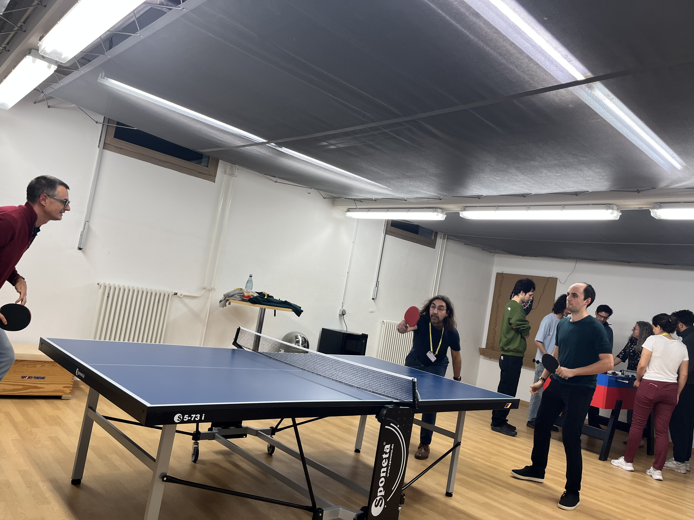
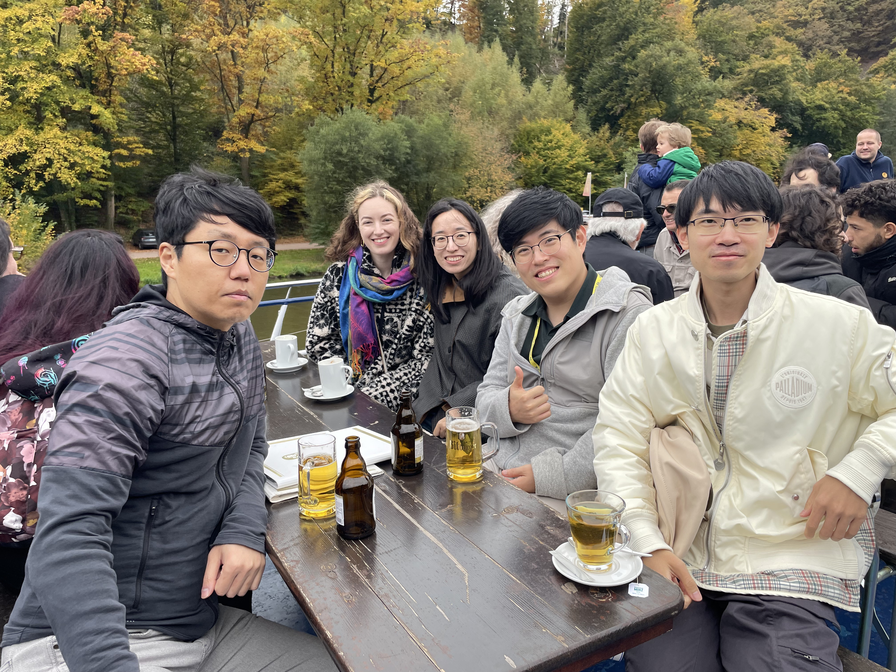
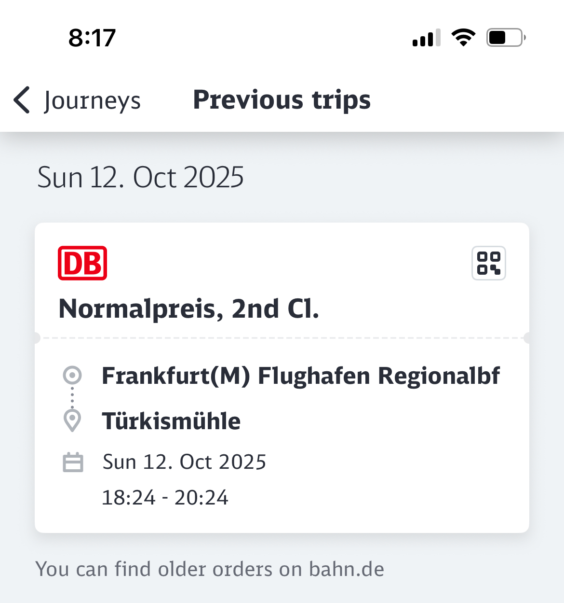
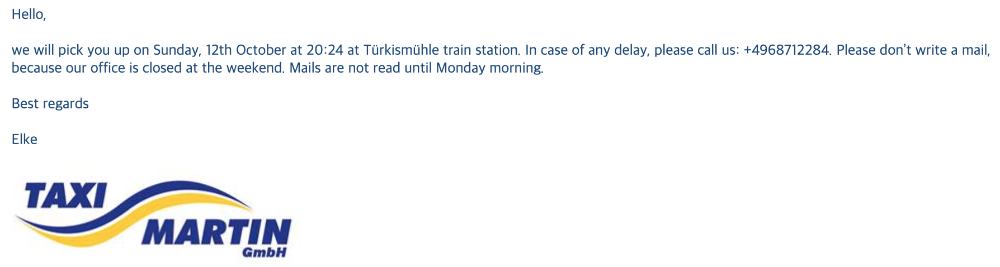
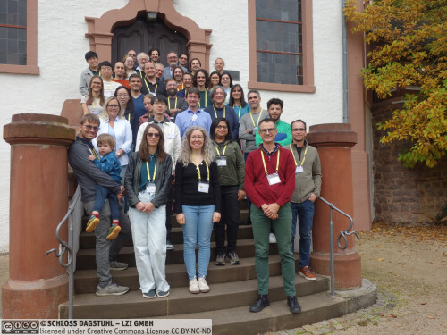

***"Dagstuhl Seminar에 처음 참석하는 사람들을 위하여"***

이 글은 Dagstuhl Seminar에 처음 참석하는 사람들을 위하여 작성된 메뉴얼이다. 
참석하러 가는 길이 간단하지 않고 정보가 많이 없기에 이 글이 처음 참석하는 사람에게 도움이 되기를 바란다.

학계에서 활동 하다 보면 어느 날 메일로 아래와 같은 초청장이 올 것이다.

Dagstuhl Seminar는 독일의 **Leibniz Center for Informatics (LZI)**에서 주최하는 컴퓨터 과학 분야의 고급 연구 세미나 시리즈로, 전 세계의 연구자들이 소규모로 모여 특정 주제에 대해 깊이 있게 논의하는 행사이다. 각 세미나는 보통 3~5일간 진행되며, 논문 발표보다는 아이디어 교류, 협력 연구의 발판 마련, 미래 연구 방향 논의에 중점을 둔다. 초청 기반으로 운영되며, 형식적 발표보다 자유로운 토론과 공동 작업이 중심이기 때문에, 새로운 연구 분야를 정의하거나 네트워킹에 좋은 기회를 얻을 수 있다. 

초청받았다면 꼭 참석 하길 권장한다. 
컨퍼런스와 Dagstuhl Seminar 중 한 곳만 참석 가능하다면 Dagstuhl Seminar를 선택하라고 하고 싶다. 
같은 분야에 있는 사람들끼리 긴밀하게 모여서 아침부터 저녁까지 논의하는 환경이기 때문에 네트워킹 측면으로는 학회와 비교할 수 없기 때문이다.

#### 추천 동선
내가 추천하는 세미나에 참석 동선은 아래와 같다. 솔직히 다른 동선은 고려하지 않았으면 한다.

1. **비행기로 프랑크푸르트 공항 도착** ✈️
2. **기차를 타고 Türkismühle역으로 이동** 🚆
3. **미리 예약한 택시를 타고 Dagstuhl 도착** 🚕

#### 미리 준비 해두어야 할 것

아래 두 가지만 미리 준비 해두면 크게 문제 없이 세미나 장소에 도착할 수 있다.

[1] DB로 Türkismühle행 기차표 예매해놓기

**주의**'기차역에 가서 직접 표를 사야지'라고 생각했다가는 크게 해멜 수 있다. 
거의 모든 비행기는 한국에서 출발했다면 독일에는 밤에 도착한다. 
기차역 직원과 대화할 수 있는 창구는 이미 닫혀있을 것이다.
현장의 기계로 발권하는 것도 쉽지 않다.
기차시간은 비행기 연착 및 출입국 심사까지 고려하여 조금 넉넉하게 잡는 것을 추천한다.
내 경우 비행기 도착시간 +1.5시간 후의 기차를 예매하였다.

[2] Taxi Martin 예약하기(필수)

Türkismühle 역 -> Dagstuhl로 이동할 택시를 예약해야 한다.

메일로 기차티켓을 첨부하여 보내면 아래와 같이 답장이 올 것이다.

**주의** 예약하지 않고 역에서 택시를 직접 잡으려 하지 않길 바란다.
역 근처에는 아무것도 없다. 

예약을 했다면 기차역 출구에 택시가 기다리고 있을 것이다. 이것을 타고 Dagstuhl로 이동하면 된다.

Seminar가 끝난 후 Dagstuhl에서 공항으로 돌아오는 길은 내 경우 세미나 주최 측에서 해주었다.

#### 마치며

이 글은 택시를 잡지 못해 세미나 참석에 무척 고생한 지인이 있어, 이와 같은 일을 방지하고자 작성하였다. 
좋은 경험을 할 수 있는 세미나이기에 잘 참석하고 즐기고 잘 돌아오길 바란다.

