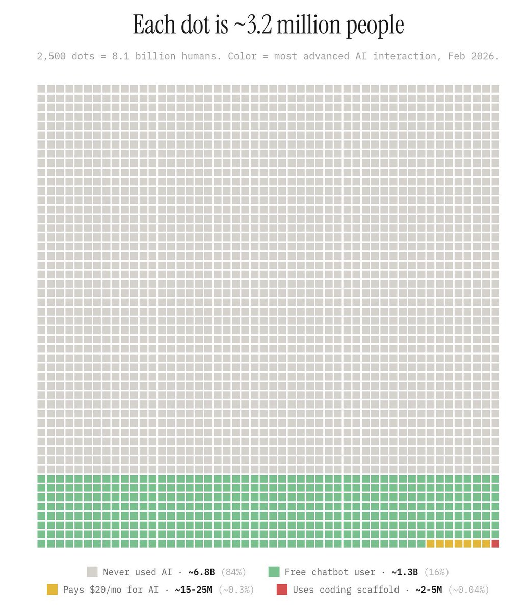
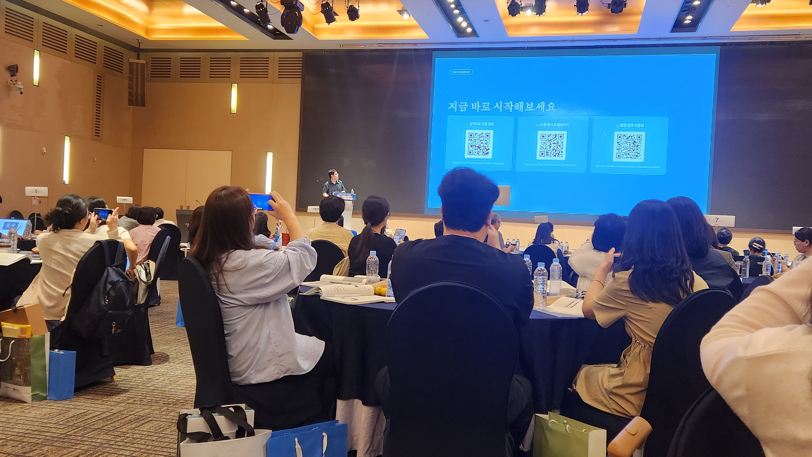

***"나의 실제 업무에 AI 사용 고민하기"***

AI 사용에 대한 기사 또는 유튜브 영상이 매일 쏟아지지만, 실제로 AI를 자신의 업무에 적극적으로 잘 활용하는 사람은 많지 않다. 아래 그래프는 전세계에서 AI를 사용하는 사람들의 통계를 나타낸 것이다 (출처: X@damianplayer).

위 표에서와 같이 강력한 유료 버전 AI를 사용하는 사람은 0.3%에 불과하고 프로그래밍에 사용하는 사람은 0.04%에 그친다고 한다. 한국으로만 보면, 사용량이 많이 올라갈 것으로 예상되지만, 개인적인 경험에 의하면 실제로 업무에 적극적으로 활용하는 사람은 많지 않다.  

2026년도에 DGIST의 교수학습 센터장을 맡게 되면서 하나의 미션을 받았다. 바로 "DGIST 구성원들이 업무/학습/수업/연구에 AI를 적극적으로 활용할 수 있도록 돕는 것"이다. 나는 업무/학습/수업/연구에 적극적으로 AI를 활용한다. 연구에서는 논문 작성/아이디어 구현/비교실험을 위한 툴 설치 등에 활용하고, 수업/학습에서는 AI를 활용해 수업 자료를 보강하고 예제를 생성하며, 학생들의 질문에 대해 AI와 함께 답변을 제공한다. 행정업무에서도 영수증 처리 등은 AI를 활용해 자동화하고 있다. 센터장으로서 내 임무는 내가 실제로 사용하고 있는 AI 활용법을 DGIST 구성원들에게 공유하고, 그들이 AI를 적극적으로 활용할 수 있도록 돕는 것이다.

AI활용을 주제로 세미나 발표를 하면서, 많은 사람들이 AI 활용능력을 키우고 싶어한다는 것을 알 수 있었다. 최근 "연구/수업에 AI를 활용하는 방법"이라는 주제로 [KCC 튜토리얼](https://www.kiise.or.kr/conference/main/getContent.do?CC=KCC&CS=2026&PARENT_ID=011900&content_no=2492) 및 KACTL 하계 워크샵에서 강연을 진행했다. 강연에서는 내가 실제로 사용하는 사례들을 공유하는 데모 중심의 발표였고, 크게 관심을 받았다.

KCC발표에서는 최근 KDD에 accept된 논문에서 AI를 활용한 사례를 공유하였고, KACTL에서는 최근 DGIST 수업에서 AI를 활용한 실제 사례를 공유하였다. 연구발표와 비교할 수 없을 정도로 많은 사람들이 관심을 가지고 질문을 해주었다. 공통적인 질문 중 하나는 "어디서 AI를 활용하는 방법을 보고 배우는가?"였다. 당시 발표에서는 유튜브를 보고 공부한다고 답을 하였지만, 돌이켜보니 이는 적절한 대답이 아니다. 

실제로 AI를 활용하는 방법을 배우는 가장 좋은 방법은 "실제로 나의 업무에 AI를 사용하는 것"이다. 이는 프로그래밍을 배우는 것과 비슷하다. 책이나 강의로 프로그래밍을 배우는 것은 한계가 있다. 프로그래밍 실력을 늘리는 가장 좋은 방법은 실제로 본인이 만들고 싶은 프로그램을 만들어보는 것이다. 만들어내는 과정에서 필요한 것들을 자연스럽게 배우게 되고, 이는 처음부터 강연이나 책으로 배우는 것보다 훨씬 효과적이다. AI 활용도 마찬가지이다. 자동으로 처리하고 싶은 업무를 정해 해당 업무를 자동화하기 위해 AI를 어떻게 활용할 수 있을지 고민하고, 실제로 AI를 활용해 업무를 자동화하는 과정에서 자연스럽게 AI 활용능력이 향상된다. 

하나의 주력 AI툴을 정해 해당 툴로 나의 실제 업무를 어떻게 자동화할 수 있을지 고민해보자. 현재 매일 새로운 AI툴 및 기술들이 쏟아지고 있다. 이들을 모두 따라다니며 배우는 것은 불가능하다. 하나의 강력한 AI툴을 정해 해당 툴을 잘 사용하는 것부터 시작하는 것이 좋다. 나의 경우 VisualStudio Code + Claude code extension을 주력으로 사용하고 있다. 이 조합으로 [연구](https://dgistpl.github.io/courses/ai_writing/2026/)/[수업](https://dgistpl.github.io/courses/claude_code/2026/)/[행정](https://dgistpl.github.io/courses/work_automation/2026/) 업무 자동화를 모두 수행하고 있다. 

주변에 AI활용을 전파하면서 많은 보람을 느끼고 있다. 고맙게도 잘 사용하고 계시는 교수님들, 학생들, 행정 선생님들이 아래와 같이 잘 사용하고 계신다는 피드백을 주셨다. 이대로 학교 내에서 AI 활용이 자연스럽게 확산되었으면 한다.

### AI를 활용한 수업자료 생성 (교수님들):

  

    
  

  

    
  

### AI를 활용한 공부법 (학생들):

  

### AI를 활용한 업무 자동화 (교직원분들):

  

